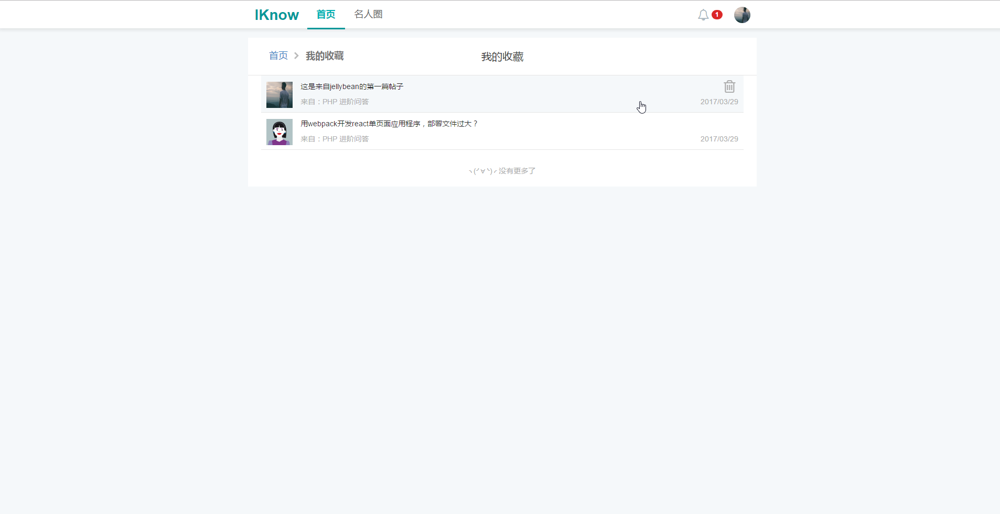

## Vue-IKnow 问答圈
用vue结合element-UI开发类似知加和小密圈的一款SPA应用

## 工具&技能

`vue`+`vuex`+`vue-router`+`vue-axios`+`vuelidate`+`vue-quill-editor`+`element-ui`

[barryvdh/laravel-cors](https://github.com/barryvdh/laravel-cors) 一个http代理的中间件，进行http请求转发，实现跨域请求

`postman` 接口测试工具

## 说明
实际接口采用本地`laravel`项目提供的`api`作为测试数据 采用**前后端分离** 仅作为学习使用
 
后端的`laravel`项目地址[https://github.com/GeekGhc/iknow-back](https://github.com/GeekGhc/iknow-back)

## 实际功能

### 用户
- [x] 登录/注册
- [x] 修改资料
- [x] 个人主页
- [x] 关注其他用户
- [x] 发表帖子
- [x] 删除帖子
- [x] 收藏帖子
- [x] 点赞帖子
- [x] 发送私信
- [x] 查看处理消息通知

### 帖子
- [x] 帖子列表
- [x] 帖子详情
- [x] 帖子评论回复
- [x] 帖子收藏列表

## 效果图

